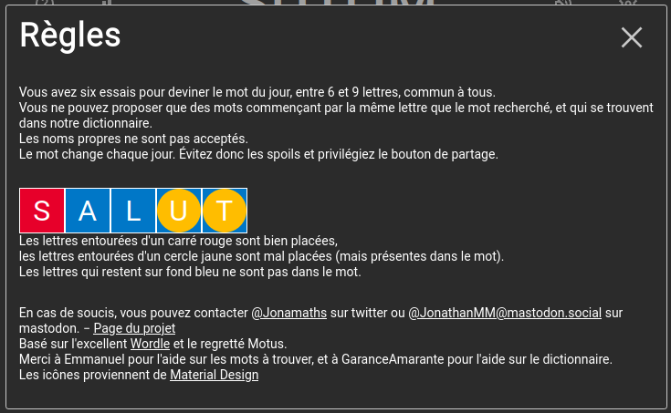

# resolveur-sutom

Encore une autre aide pour trouver le mot du jour du jeu [sutom](https://sutom.nocle.fr)

Le code du jeu est [ici](https://framagit.org/JonathanMM/sutom)

les règles sont les suivantes :

## Solution

### Logiciel
L'application est une application web utilisant le framework **Flask**, python html,css.

### Les données
Eelle utilise le dictionnaire de mots de l'application, stocké dans une petite base **SQLite**, soit 170404 mots de longueur comprise en 6 et 9 lettres.

### structure de la table
TABLE dictionnaire   
    mots     TEXT,   
    longueur INT, # longueur du mot  
    voyelle  INT, # nombre de voyelle   
* indicateurs de présence de la voyelle dans le mot.  1 vs 0   
    a        INT,  
    e        INT,  
    i        INT,  
    o        INT,  
    u        INT,  
    y        INT  

##
